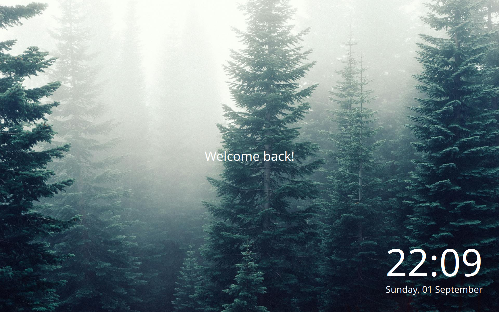

# Readme

Sequoia is a modern eye-candy theme for SDDM, making use of Nerd Fonts for its icons.

Written from scratch, it is primarily made for standalone SDDM, aiming to be customisable with accessibility options.




## Installation

*Packages used in this guide are for Arch Linux, package names may vary for your distro*

### Dependencies

* sddm
* [a Nerd Font](https://www.nerdfonts.com/) >= v3.0
* Qt6 >= 6.6
  * qt6-declarative
  * qt6-5compat

### Manual Installation

1- Once you have downloaded the tarball through the releases tab or cloning this repository, extract it to the SDDM theme directory *(change the archive path if needed)*:

```
$ sudo tar -xzvf ~/sequoia.tar.gz -C /usr/share/sddm/themes
```

2- Edit your [SDDM config file](https://man.archlinux.org/man/sddm.conf.5) under `[Theme]` change `Current` to `Current=sequoia` *(make sure to match the theme name with the theme's directory)*

It should look like this:

```conf
[Theme]
Current=sequoia
```

### On screen keyboard

If you wish to use the virtual keyboard, install [qt6-virtualkeyboard](https://archlinux.org/packages/?name=qt6-virtualkeyboard)

then edit your SDDM config file, under `[General]` set `InputMethod` to `qtvirtualkeyboard`:

```conf
[General]
InputMethod=qtvirtualkeyboard
```

see also: [the Arch wiki guide](https://wiki.archlinux.org/title/SDDM#Enable_virtual_keyboard)

### Testing

You can easily try out themes without changing your SDDM config or repeatedly logging out using this command:

```
$ sddm-greeter-qt6 --test-mode --theme /path/to/your/theme
```

It's quite the time-saver when configuring your `theme.conf` file.

## Support

If you want to show support by buying me a coffee or send a tip feel free to visit my ko-fi page :3 <br/>
[](https://ko-fi.com/Y8Y0473AA)
